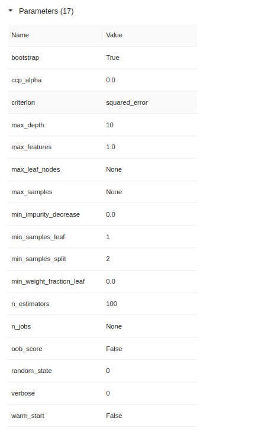

# HOMEWORK SOLUTION

### QUESTION 1

Create a new conda environment:
```bash
$ conda create -n homework-02 python=3.9 
``` 

And install the dependencies:
```bash
$ pip install -r requirements.txt
```

```bash
$ mlflow --version
mlflow, version 1.26.0
```

### QUESTION 2

Downloading datasets:
```bash
for month in `seq 3`; do 
    curl -s -o "scripts/data/green_tripdata_2021-0${month}.parquet" "https://s3.amazonaws.com/nyc-tlc/trip+data/green_tripdata_2021-0${month}.parquet"
done
```

And run the preprocess_data.py script:
```bash
$ cd scripts/
$ python preprocess_data.py --raw_data_path data --dest_path ./output
```

```bash
$ ls scripts/output
dv.pkl  test.pkl  train.pkl  valid.pkl
$ ls -l scripts/output | wc -l
4
```
Solution: 4

### QUESTION 3

Running mlflow with default parameters
```bash
$ mlflow ui
```


The parameters register with `autlog` are 18:




### QUESTION 4

Launching mlflow tracking server with an SQLITE and `./artifacts` folder for artifacts store:

```bash
$ mlflow ui --backend-store-uri "sqlite:///mlflow.db" --default-artifact-root "./artifacts"
```
Check the full path in the image:


Solution: `default-artifact-root`


### QUESTION 5

Running and updating the `hpo.py` script to register the RMSE metric:
```bash
$ python hpo.py
```
The metrics are sorted (from lower to higher):


Solution: 6.628


### QUESTION 6

Running and updating the `register_model.py` script to get the best model and register a new model version:

```bash
$ python register_model.py
```
The metrics are sorted (from lower to higher):


Solution: 6.55
