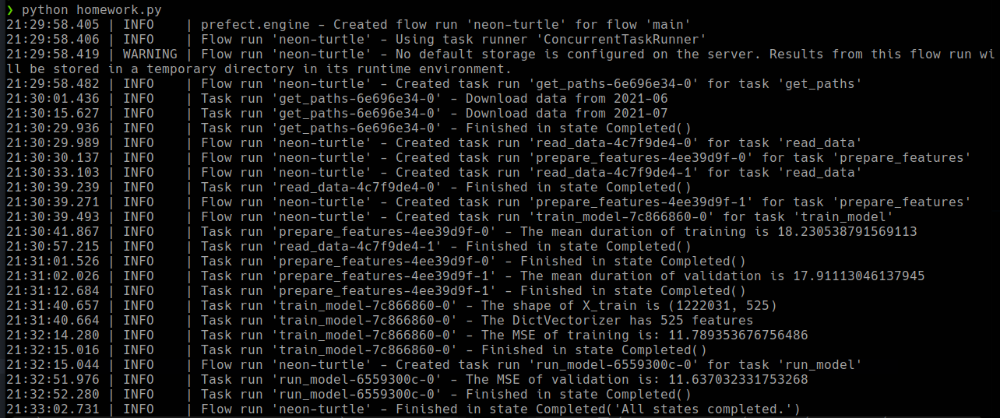
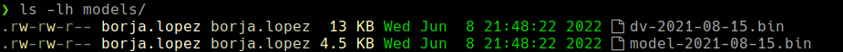
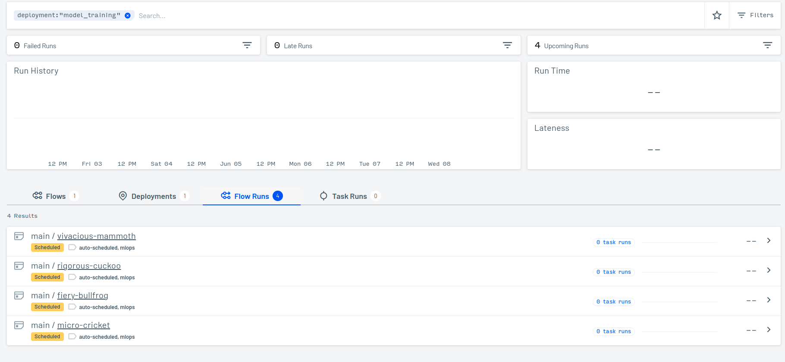
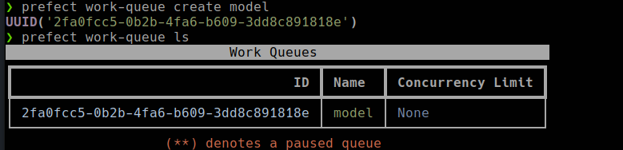

# HOMEWORK SOLUTION

### PREPARATION

Create a new conda environment:
```bash
$ conda create -n homework-03 python=3.9
```

And install the dependencies:
```bash
$ pip install -r requirements.txt
```

Download the data: 

```bash
$ bash -x download_data.sh
```

### QUESTION 1

Unpacking: https://www.pythontutorial.net/python-basics/python-unpacking-tuple/

Because the only task that need to be unpacked is the `train_model` task:

```python
    # train the model
    lr, dv = train_model(df_train_processed, categorical).result()
```
```bash
$ cd src && python homework.py  
```
SOLUTION: `train_model`


### QUESTION 2

You can see the `get_paths` code [here](./src/homework.py).

Running the script I can get the following MSE validation:

```bash
$ python homework.py
```



SOLUTION: `11.637`

### QUESTION 3

You can see the code [here](./src/homework.py) to view how the models are saved.

Running the script I can write the model and the DV:

```bash
$ python homework.py
```



SOLUTION: `13,000 bytes`


### QUESTION 4

You can see the code [here](./src/homework.py) to view the deploymentspec.

After create the deployment we need to configure a storage (in our case we will use local storage):

If you don't have any storage configured this one will be your default storage:
```bash
$ prefect storage create
> 3
> ~/.prefect
```
You can change the default storage running the following command:
```bash
$ prefect storage ls # to list and get the storage id
$ prefect storage set-default <storage-id>
```

Create a deployment using the following command:
```bash
$ prefect deployment create ./homework.py
$ prefect deployment ls
$ prefect deployment inspect 'main/<deployment_name>' 
```

You can check in [crontab.guru](https://crontab.guru)

SOLUTION: `0 9 15 * *`


### QUESTION 5

After running the script we can review the task that are scheduled to run (please take a look at the following picture).

```bash
$ python homework.py
```


SOLUTION: `3`


### QUESTION 6

To create a simple work queue run this command:

```bash
$ prefect work-queue create <name>
```

The different options provided:
1. `prefect work-queue inspect` -> To get details about a queue.
2. `prefect work-queue ls` -> List all queues available 
3. `prefect work-queue preview` -> Displays scheduled flow runs for a specific work.
4. `prefect work-queue list` -> Command doesn't exist

More on this link: https://orion-docs.prefect.io/concepts/work-queues/



SOLUTION: `prefect work-queue ls`

