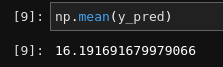
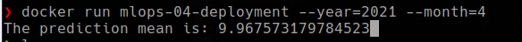

# HOMEWORK SOLUTION

### PREPARATION

Create a new conda environment:
```bash
$ conda create -n homework-04 python=3.9
```

And install the dependencies:
```bash
$ pip install -r requirements.txt
```

### QUESTION 1



SOLUTION: `16.19`


### QUESTION 2


SOLUTION: `19M`

### QUESTION 3

SOLUTION: `jupyter nbconvert --to script starter.ipynb`


### QUESTION 4

Creating a virtualenv with pipenv. First install pipenv:

```bash
$ pip install pipenv # with pip
$ conda install -c conda-forge pipenv # with conda
```
After installing pipenv, create the virtualenv installing the dependencies. For example:

```bash
$ pipenv install scikit-learn==1.0.2 click numpy pandas
```

SOLUTION: `sha256:08ef968f6b72033c16c479c966bf37ccd49b06ea91b765e1cc27afefe723920b`


### QUESTION 5

Using [click](https://click.palletsprojects.com/)

Running the script you must to enter into the virtualenv created by pipenv:
```bash
$ pipenv shell
$ python src/predict.py --year=2021 --month=3
```


SOLUTION: `16.29`


### QUESTION 6

```bash
$ docker build -t mlops-04-deployment .
$ docker run mlops-04-deployment --year=2021 --month=4 
```


SOLUTION: `9.96`


### BONUS

Using S3 to store the results instead of using the ephemeral container storage.

```
$ docker run -e BUCKET_NAME=my-bucket -e AWS_ACCESS_KEY_ID=AKIA2UUANSHEXAMPLE -e AWS_SECRET_ACCESS_KEY=12343i8473743nGAGyuuABEXAMPLE mlops-04-deployment --year=2021 --month=4
The prediction mean is: 9.967573179784523
```


### IMPROVEMENTS

- Add better logging to the `predict.py` script.
- Convert to a fastapi/flask application.