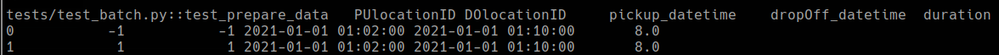
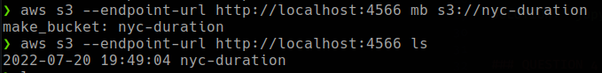
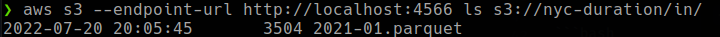
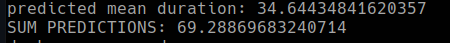

# HOMEWORK SOLUTION

### PREPARATION

Create a new conda environment:
```bash
$ conda create -n homework-06 python=3.9
$ conda install -c conda-forge pipenv
```

And install the dependencies:
```bash
$ pipenv install --dev
```

### QUESTION 1

SOLUTION: `if __name__ == "__main__"`


### QUESTION 2


SOLUTION: `__init__.py`

### QUESTION 3



SOLUTION: `2`


### QUESTION 4



SOLUTION: `aws s3 --endpoint-url http://localhost:4566 mb s3://nyc-duration`


### QUESTION 5



SOLUTION: `3512`


### QUESTION 6



SOLUTION: `69.28`


### BONUS

Instead of creating a simple bash script I have created a Makefile file to run all the tests.
